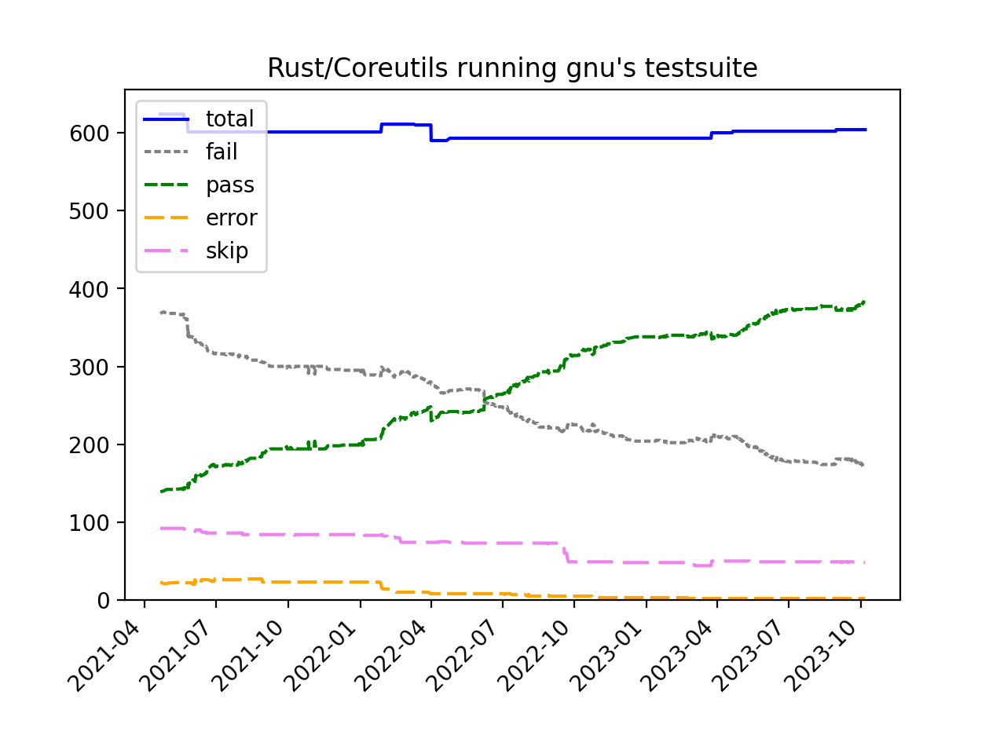

<h1>uutils coreutils</h1>
<h1 class="subtitle">&amp; the quest for compatibility</h1>

--- whoami

- Terts Diepraam

- Recent graduate of TU Delft

- A maintainer on uutils since 2021

--- uname

# uutils coreutils

Cross-platform reimplementation of the coreutils in Rust

--- GNU Coreutils

<div style="margin: auto; gap: 4px; font-size: 0.5em; display: grid; grid-template-columns: repeat(auto-fit, 11ch); grid-auto-flow: row; width: 100%;">
<span><code>arch</code></span>
<span><code>b2sum</code></span>
<span><code>base</code></span>
<span><code>basename</code></span>
<span><code>basenc</code></span>
<span><code>cat</code></span>
<span><code>chgrp</code></span>
<span><code>chmod</code></span>
<span><code>chown</code></span>
<span><code>chroot</code></span>
<span><code>cksum</code></span>
<span><code>comm</code></span>
<span><code>cp</code></span>
<span><code>csplit</code></span>
<span><code>cut</code></span>
<span><code>date</code></span>
<span><code>dd</code></span>
<span><code>df</code></span>
<span><code>dir</code></span>
<span><code>dircolors</code></span>
<span><code>dirname</code></span>
<span><code>du</code></span>
<span><code>echo</code></span>
<span><code>env</code></span>
<span><code>expand</code></span>
<span><code>expr</code></span>
<span><code>factor</code></span>
<span><code>false</code></span>
<span><code>fmt</code></span>
<span><code>fold</code></span>
<span><code>groups</code></span>
<span><code>hashsum</code></span>
<span><code>head</code></span>
<span><code>hostid</code></span>
<span><code>hostname</code></span>
<span><code>id</code></span>
<span><code>install</code></span>
<span><code>join</code></span>
<span><code>kill</code></span>
<span><code>link</code></span>
<span><code>ln</code></span>
<span><code>logname</code></span>
<span><code>ls</code></span>
<span><code>md5sum</code></span>
<span><code>mkdir</code></span>
<span><code>mkfifo</code></span>
<span><code>mknod</code></span>
<span><code>mktemp</code></span>
<span><code>more</code></span>
<span><code>mv</code></span>
<span><code>nice</code></span>
<span><code>nl</code></span>
<span><code>nohup</code></span>
<span><code>nproc</code></span>
<span><code>numfmt</code></span>
<span><code>od</code></span>
<span><code>paste</code></span>
<span><code>pathchk</code></span>
<span><code>pinky</code></span>
<span><code>pr</code></span>
<span><code>printenv</code></span>
<span><code>printf</code></span>
<span><code>ptx</code></span>
<span><code>pwd</code></span>
<span><code>readlink</code></span>
<span><code>realpath</code></span>
<span><code>relpath</code></span>
<span><code>rm</code></span>
<span><code>rmdir</code></span>
<span><code>seq</code></span>
<span><code>sha1sum</code></span>
<span><code>sha224sum</code></span>
<span><code>sha256sum</code></span>
<span><code>sha384sum</code></span>
<span><code>sha512sum</code></span>
<span><code>shred</code></span>
<span><code>shuf</code></span>
<span><code>sleep</code></span>
<span><code>sort</code></span>
<span><code>split</code></span>
<span><code>stat</code></span>
<span><code>stdbuf</code></span>
<span><code>stty</code></span>
<span><code>sum</code></span>
<span><code>sync</code></span>
<span><code>tac</code></span>
<span><code>tail</code></span>
<span><code>tee</code></span>
<span><code>test</code></span>
<span><code>timeout</code></span>
<span><code>touch</code></span>
<span><code>tr</code></span>
<span><code>true</code></span>
<span><code>truncate</code></span>
<span><code>tsort</code></span>
<span><code>tty</code></span>
<span><code>uname</code></span>
<span><code>unexpand</code></span>
<span><code>uniq</code></span>
<span><code>unlink</code></span>
<span><code>uptime</code></span>
<span><code>users</code></span>
<span><code>vdir</code></span>
<span><code>wc</code></span>
<span><code>who</code></span>
<span><code>whoami</code></span>
<span><code>yes</code></span>
</div>

--- GNU Coreutils

- Set of utilities you probably have on your system
- "Standard library of Bash"
- Written in C
- Maintained by the FSF

--- A brief history of uutils

- Started in August of 2013 by Jordi Boggiano
- 2 years before Rust 1.0!
- Several maintainers over the years
- 2020: Sylvestre Ledru put focus on GNU compatibility
- Active maintainers: Sylvestre Ledru, Daniel Hofstetter and me

--- Compatibility

- No compatibility? No chance of adoption
- GNU is most familiar
- Every quirk is used by _someone_



---

<div style="text-align: center; margin-bottom: 1em;">
The problem:
</div>

# `C != Rust`

--- The Topic

**Emulating C behaviour in Rust**

---

Case Study 1

# Error Handling

--- The C Way

GNU coreutils deal with errors in two ways:

1. Exit immediately
2. Store exit code for later

Error are usually printed immediately

--- The Rust Way

- `Result`
- It's great to know which functions can fail!
- `?` is great too!
- Exit: bubble up the `Err`
- Store exit code: ???

--- Requirements for our solution

- In the style of Rust
- Control of exit code
- With convenient API for the GNU-style error handling
- Must work well with IO errors

--- The uutils error trait: exit code

```rust
trait UError: Error + Send {
    fn code(&self) -> i32 { ... }
}

type UResult<T> = Result<T, Box<dyn UError>>;
```

--- IO Errors

```rust
std::fs::copy(a, b).map_err_context(|| {
    format!("cannot copy {} to {}", a.quote(), b.quote())
});
```
(Inspired by `anyhow` and `eyre`, of course)

--- Storing exit code

```rust
// Prints the error and stores the exit code
show!(some_uerror);
```

It's not very idiomatic but it works really well for our use case

--- Error Handling Lessons

- `Result` is great!
- Error handling in Rust requires more "design"
- Don't be afraid to make custom error handling
- Practicality over purity

---

Case Study 2

# Argument Parsing

--- The C Way

```C
while ((c = getopt(argc, argv, "ab:")) != -1) {
  switch (c) {
    case 'a':
      aflag = 1;
      break;
    case 'b':
      bvalue = optarg;
      break;
    case '?':
    default:
      abort();
    }
}
```

--- There's a lot not to like there

- `-1` as error value
- Specifying arguments as a string
- Modifying globals
- No exhaustiveness checking
- Error messages not automatic
- etc.

--- The Rust Way

- `clap` is great!
- Automatic `--help`, error messages, completions, etc.
- `clap` "collects" all results into a final data structure
- Builder API: Into a `HashMap`
- Derive API: Into custom `struct`

--- Clap in uutils

- We use `clap` at the moment
- Though the derive API is not flexible enough
- Sometimes it is hard

--- A problem in ls (and in other utils)

The `-o` flag does two things:
- Use the `-l` format,
- Hide the group.

Setting `-o -C -l` is the same as `-o`

It is _partially overridden_ by other arguments!

This is possible but very hard in `clap`

--- Other problems

```bash
head -10 some_file.txt  # clap doesn't have the -N
seq -s= 10              # clap uses = as separator
# etc.
```

---

Small incompatibilities sneak in

And workarounds lead to overcomplicated code!

<div style="font-size: 0.5em;">

Note: _none_ of this is `clap`'s fault! It's a great library, it's just not made for coreutils.

</div>

--- A new argument parser (WIP)

- Solution: custom argument parser!
- Derive not on a `struct` but an `enum`
- Mirrors the _structure_ of `getopt`
- So the default behaviour is the same

--- Small preview (sample from ls)

```rust
#[derive(Arguments)]
enum Arg {
    /// Do not ignore entries starting with .
    #[option("-a")]
    All,

    /// Sort by WORD
    #[option("--sort=WORD")]
    #[option("-t", default = Sort::Time, help = "Sort by time")]
    Sort(Sort),
}

struct Settings {
    which_files: Files,
    sort: Sort,
}

impl Options<Arg> for Settings {
    fn apply(&mut self, arg: Arg) {
        match arg {
            Arg::All => self.which_files = Files::All,
            Arg::AlmostAll => self.which_files = Files::AlmostAll,
            Arg::Sort(s) => self.sort = s,
        }
    }
}
```

--- Argument Parsing Lessons

- Defaults matter!
- We can take the best ideas from other libraries
- And apply them in our own way

--- Final Words

- We care about compatibility!
- But compatibility is hard!

--- Links

<div style="display: grid; grid-template-columns: 1fr 1fr; gap: 1em;">
<div>

Come talk to me!
- During the break
- [@tertsdiepraam on GitHub](https://github.com/tertsdiepraam/)
- [@terts@mastodon.online](https://mastodon.online/@terts)

</div>
<div>

Links to uutils
- [uutils.github.io](https://uutils.github.io/)
- [uutils/coreutils on GitHub](https://github.com/uutils/coreutils)
- [uutils Discord](https://discord.gg/wQVJbvJ)

</div>
</div>

---